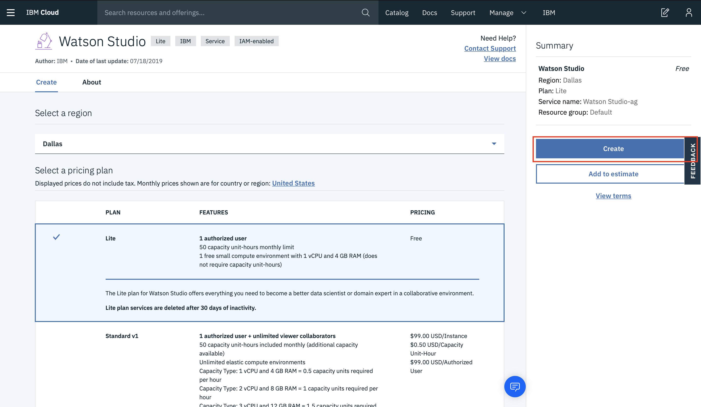
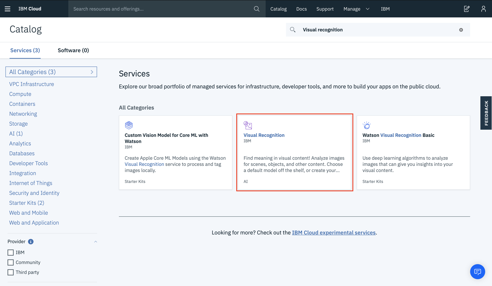
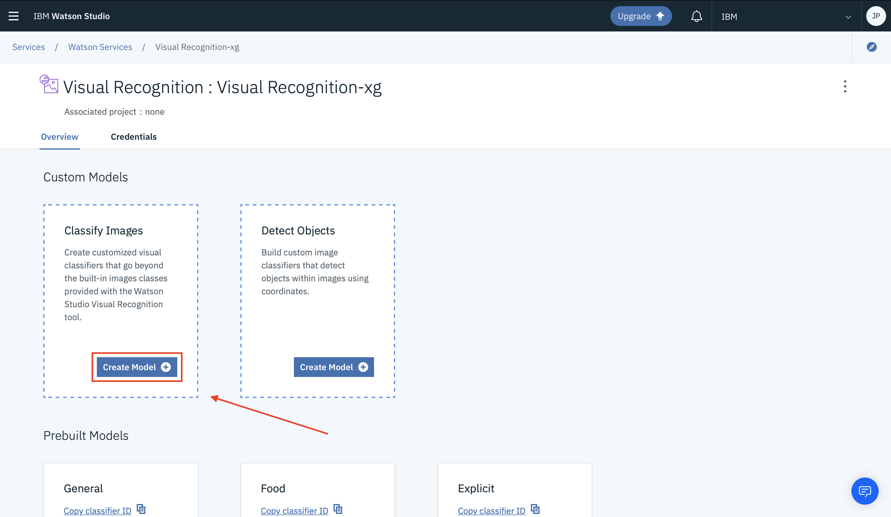
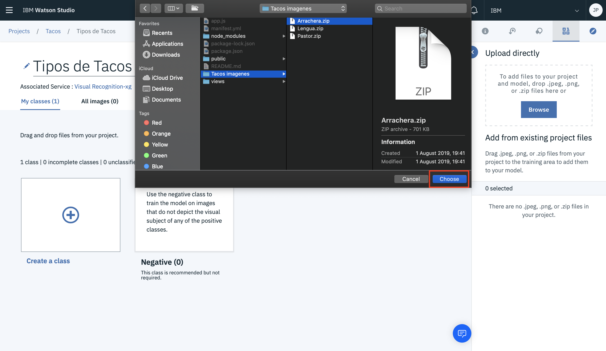

# Workshop - Visual recognition 
Aprende a crear un servicio de visual recognition en IBM Cloud para clasificar tacos!
# Pre-requisitos
•	Tener instalado [**Node.js**](https://nodejs.org/es/). 
•	Tener una cuenta de [**IBM Cloud**](https://cloud.ibm.com/login). 
•	Clonar este Repositorio de [**Github**](https://github.com/ibmdevadvmx/Visual-Recognition-Taco ).  
## 1. Crea el Servicio de Watson Studio
Entra a [**IBM Cloud**](https://cloud.ibm.com/) e ir a la sección de catálogo.   
    
Buscar el servicio “Watson Studio” (Escríbelo en el buscador o encuéntralo en la sección “AI”) y crear el servicio.  
 
  
## 2.	Crear el Servicio de Visual Recognition
Dentro de [**IBM Cloud**](https://cloud.ibm.com/) ir a la sección de catálogo.  
 
Buscar el servicio “Visual Recognition” (Escríbelo en el buscador o encuéntralo en la sección “AI”) y crear el servicio.  
  
  
Ir a "Manage” y dar click en “Create a custom model”  
  
Automaticamente se creará el servicio de “Object Storage”. 

## 3.	Crear el modelo un modelo en Visual Recognition
### Dentro del panel de Visual Recognition, realizar los siguientes pasos:
      1.	En el apartado de "Classify Images" hacemos clic en “Create Model”
    
   
      2.	Ingresamos el nombre “Tacos”.
      3.	Seleccionamos los servicios anteriormente creados (Watson Studio y Object Storage).
      4.	Hacemos clic en el botón “Create”.
     
   
      5.	Agregar archivos al proyecto y entrenamiento
        •	Cambiamos el nombre del Modelo por “Tipos de tacos”
     
   
        •	Agregamos los archivos .zip que se encuentran en la carpeta “Tacos imágenes” (del repositorio) en el área de “Upload to Project”
     
   
        •	Seleccionamos todos los archivos importados y hacemos clic en “Add to model” 
     

        •	Una vez cargadas las fotos podremos observaremos que aparece “Ready to train” y haremos clic en “Train model”.
     
   
        •	Una vez finalizado el entrenamiento podremos probarlo con el archivo “pastor.jpg” que se encuentra en la carpeta "Imagenes Prueba" de este repositorio

6.	Obtenga las credenciales del servicio

•	Abra una nueva pestaña en su navegador para acceder IBM Cloud: 
https://cloud.ibm.com¬/

•	En el panel de control, haga clic en el servicio>VisualRecognition>ServiceCredentials y de clic en ver credenciales.
•	Copia las credenciales en el editor de texto de tu preferencia para que podamos usarlas más tarde. Las credenciales se verán como estas:
•	Ahora puede cerrar esta pestaña del navegador.

7.	Probando la app 
    •	Configurar las credenciales en el archivo “app.js” de la carpeta visual-recognition-taco-master
    •	Copiamos el “apikey” de las credenciales que copiamos en el paso anterior y la colocamos en la variable “iam_apikey”.
    •	Para obtener el model ID vamos al apartado Tipos de Tacos y copiamos como a continuación se indica.
    •	Lo sustituimos en la variable “classifier_ids” de nuestro documento “app.js”.
      •	Abrir terminal y correr los siguientes comandos dentro de la carpeta bootcampMx-VisualRecognition-master:
      1.	Ingresar: npm install 
      2.	Ingresar: npm start

      •	Dirigirse al localhost en el puerto “8080 ” introduciendo esta liga: http://localhost:8080/ 

      •	Selecciona el archivo “pastor.jpg” para probar la aplicación.

      •	Da Clic en el botón “Clasificador de taco personalizado“ para utilizar el modelo que acabamos de crear y observar el r                          esultado.

      •	Volver a seleccionar el archivo “lengua.jpg”y hacer clic en el botón “Clasificador general” para utilizar el clasificador por defecto de Watson Visual Recognition y observar el resultado.

8.	Desplegar app en la nube 
    •	Primero tenemos ir a la dirección de la carpeta que descargamos desde la terminal.

    •	Nos logearemos a la plataforma de IBM Cloud con el comando IBM Cloud login e ingresaremos el correo y la contraseña con la que creamos la cuenta en IBM.

    •	Correremos el siguiente comando “ibmcloud target –cf” para redirigir nuestra aplicación al API endpoint por default.

    •	Y por último correremos el comando “ibmcloud cf push” para desplegar nuestra aplicación en la nube.

        •	Después de un momento terminará de subir la aplicación a la nube y nos arrojará diferentes detalles de nuestra aplicación, copiaremos la liga que nos da y la pegamos en una ventana de nuestro navegador para probar nuestra app desde la nube.

        •	La probamos y observamos que funciona de manera correcta.

    •	De igual manera podemos observar desde la página de IBM Cloud en el apartado de “Apps de Cloud Foundry” que ya se encuentra en ejecución nuestra aplicación.
